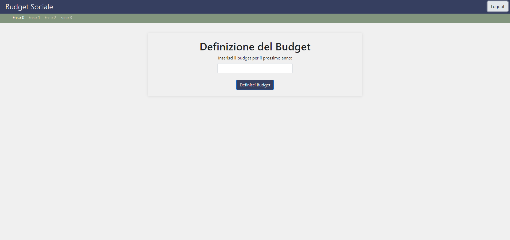
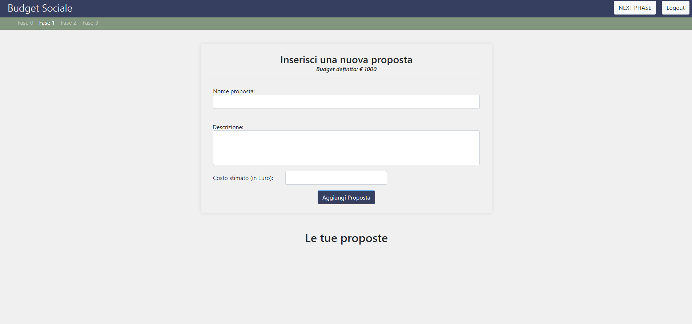
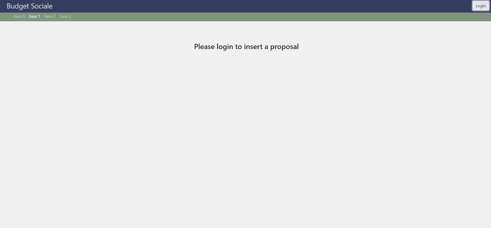
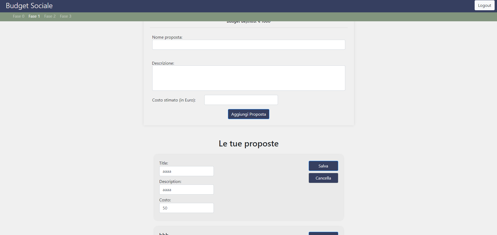
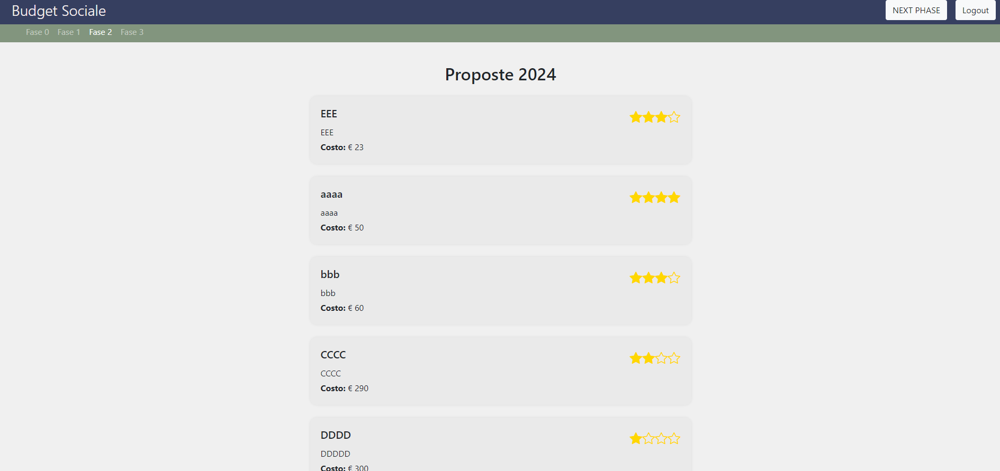
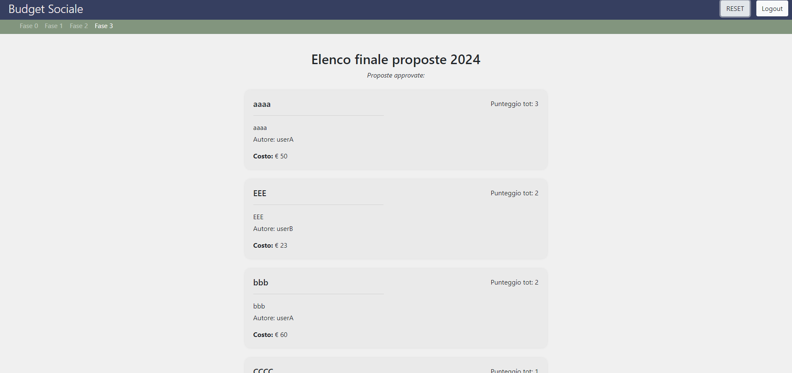
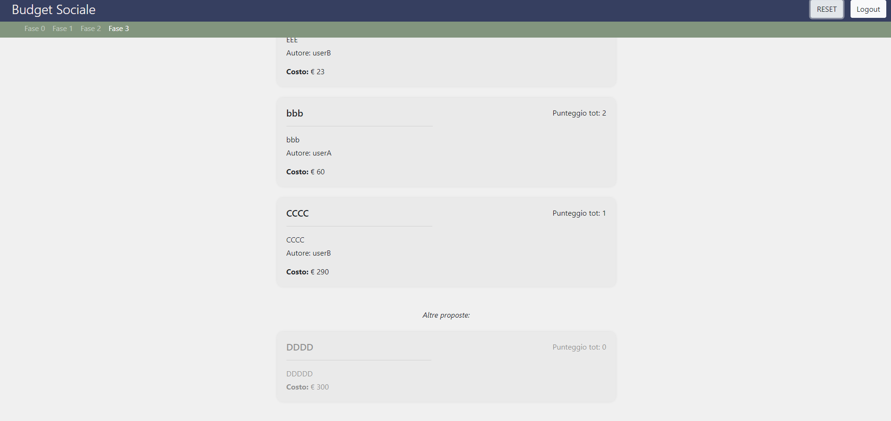

[](https://classroom.github.com/a/OLXYiqlj)
# Exam #2: "Budget Sociale"
## Student: s334148 BRIZZI MARIALUIGIA 

## React Client Application Routes

- Route `/`: l'app si sviluppa su un'unica pagina

## API Server

# Autenticazione
- POST `/api/sessions`: login
  - request parameters 
   ```mjs
    { 
      username: "username "; 
      password: "password";
    }
    ```
  - response body content
  ```mjs
    { 
      username: "username "; 
      name: "name";
      surname: "surname";
      isadmin: true || false;
    }
    ```

- GET `/api/sessions/current`: ritorna info utente
  - request parameters None
  - response body content
  ```mjs
      { username: "username "; 
        name: "name";
        surname: "surname";
        isadmin: true || false;
      }
      ```

- DELETE `/api/sessions/current`: logout
  - request parameters and request body content: None

# Proposte
- GET `/api/proposals/approved`: ritorna proposte approvate
  - request parameters None
  - response body content
  ```mjs
      [
        {
          id: 'Proposal id'
          author: 'Proposal author'
          description: 'Proposal description'
          cost: 'Proposal cost' // number
          score: 'Proposal final score' // number
          isapproved: true
        }
      ]
      ```
- GET `/api/proposals`: ritorna tutte le proposte
    - request parameters None
    - response body content
    ```mjs
        [
          {
            id: 'Proposal id'
            author: 'Proposal author'
            description: 'Proposal description'
            cost: 'Proposal cost' // number
            score: 'Proposal final score' // number
            isapproved: true || false
          }
        ]
        ```
- PUT `/api/proposals/`: inserisce proposta
    - request parameters: 
    ```mjs
     {
      name: "Proposal name";
      description: "Proposal description";
      cost: "Proposal cost"; // number
     }
    ```
    
    - response body content
    ```mjs
      {
        response: true;
      }
    ```
- PUT `/api/proposals/edit`: modifica proposta
    - request parameters: 
    ```mjs
     {
      id: "Proposal id";
      name: "Proposal name";
      description: "Proposal description";
      cost: "Proposal cost"; // number
     }
    ```
    
    - response body content
    ```mjs
      {
        response: true;
      }
    ```
- DELETE `/api/proposals/`: elimina proposta
    - request parameters: 
    ```mjs
     {
      id: "Proposal id";
     }
    ```
    
    - response body content
    ```mjs
      {
        response: true;
      }
    ```
- DELETE `/api/proposals/all`: elimina tutte le proposte
    - request parameters: None
    
    - response body content
    ```mjs
      {
        response: true;
      }
    ```

# Preferenze
- GET `/api/preferences/`: ritorna voti utente loggato
  - request parameters None
  - response body content
  ```mjs
  [
    {
      id: 'Vote id'
      proposalid: 'Proposal id'
      voter: 'User username'
      score: 'Vote score' // number in [0, 3]
    }
  ]
  ```
- POST `/api/preferences/`: inserisce voti nel database
  - request parameters 
  ```mjs
      
  {
    proposalid: 'Proposal id',
    vote: 'Proposal score' // number in [0, 3]
  }
      
    ```
  - response body content
  ```mjs
  {
      true;
  }
  ```
- DELETE `/api/preferences/`: elimina un voto da db
  - request parameters 
  ```mjs
  {
    proposalid: 'Proposal id',
  
  }
    ```
  - response body content
  ```mjs
  {
      true;
  }
  ```
# Fase
- GET `/api/phase/`: restituisce fase corrente
  - request parameters: None
  - response body content
  ```mjs
  {
    id: 'Phase id',
    phase: 'Phase number', // number
    budget: 'Phase budget' // number
  }
    ```
- PUT `/api/phase/`: inserisce la fase o la modifica nel db
  - request parameters: 
  ```mjs
  {
    phase: 'Phase number', // number
    budget: 'Phase budget' // number
  }
    ```
  - response body content
  ```mjs
  {
    true;
  }
    ```
- DELETE `/api/phase/`: reset db includendo tabella voti, proposte e fasi
  - request parameters: None
  - response body content
  ```mjs
  {
    true;
  }
    ```


## Database Tables

- Table `users` - contiene utenti 
  - username: ID PRIMARY KEY
  - name: nome utente
  - surname: cognome
  - password
  - salt
  - isAdmin: indica se è amministratore o utente (cambiano i diritti)

- Table `proposals` - contiene tutte le proposte 
  - id: ID PRIMARY KEY
  - name
  - description
  - cost
  - user: utente che ha fatto proposta
  - score: somma voti
  - isApproved: indica se è approvata o meno

- Table `preferences` - contiene i voti alle proposte
  - id: ID PRIMARY KEY
  - vote: da 0 a 3
  - user: utente che ha votato
  - idProposal: proposta votata

- Table `phases` - serve per gestire le varie fasi e condividere il budget definitivo
  - id: ID PRIMARY KEY
  - phase: da 0 a 3
  - budget

## Main React Components

- `Header`(in `header/Header.jsx`): è l'intestazione della pagina. Al suo interno vi è una navbar utilizzata per indicare a che fase ci si trova e una serie di bottoni (login/logout, next phase per la fase 1-2 e reset solo per l'ultima fase se utente è admin)

- `Login` (in `login/Login.jsx`): contiene il form per effettuare il login (inserimento username e password)
- `App` (in `App.jsx`):
- `Phase0` (in `phases/Phase0.jsx`): è la pagina per la fase 0. Per l'amministratore vi è un form per inserire l'importo budget.
- `Phase1` (in `phases/Phase1.jsx`): è la pagina per la fase 1. Ci sono due sezioni: nella prima c'è un form per inserire una nuova proposta dove viene anche mostrato il budget definito e nella seconda vi è la lista delle proposte già fatte dall'utente loggato.
  - `Proposal1` (in `proposals/proposal1.jsx`): è il template per le proposte inserite. Esse si possono modificare o eliminare
- `Phase2` (in `phases/Phase2.jsx`): è la pagina per la fase 2. Qui vi è la possibilità di inserire un voto per le proposte degli altri utenti. 
  - `Proposal2` (in `proposals/proposal2.jsx`): è il template per le proposte che permettono votazione. La votazione sarà fatta con le stelle (4): averne 1 significa voto 0.
- `Phase3` (in `phases/Phase3.jsx`): è la pagina per la fase 3. In questa fase le proposte saranno ordinate in ordine decrescente di score e in caso di due score uguali per ordine crescente di costo. Ci saranno inoltre, le proposte approvate la cui somma dei costi non deve superare il budget e le proposte non approvate.
  - `Proposal3` (in `proposals/proposal3.jsx`): è il template per le proposte della fase 3.


## Screenshot
*login*


*definizione budget (admin)*



*aggiungere proposte + tasto next phase (admin)*



*messaggio a utenti non loggati*



*modifica una tua proposta*



*vota una proposta*



*elenco finale proposte approvate*



*elenco finale proposte non approvate*




## Users Credentials

| username | password |  role |
| :------- | :------- | ----: |
| admin    | admin    | admin |
| userA    | userA    |  user |
| userB    | userB    |  user |
| userC    | userC    |  user |
